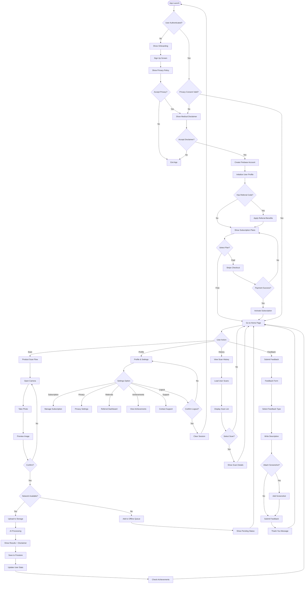
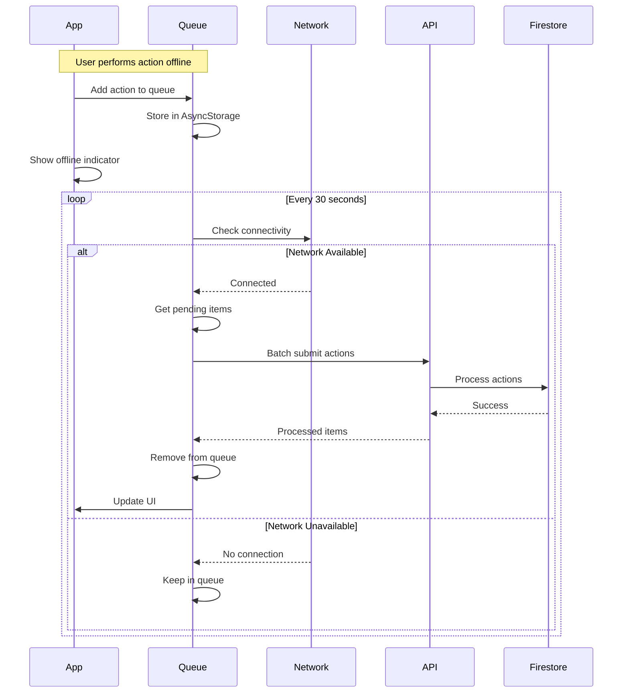
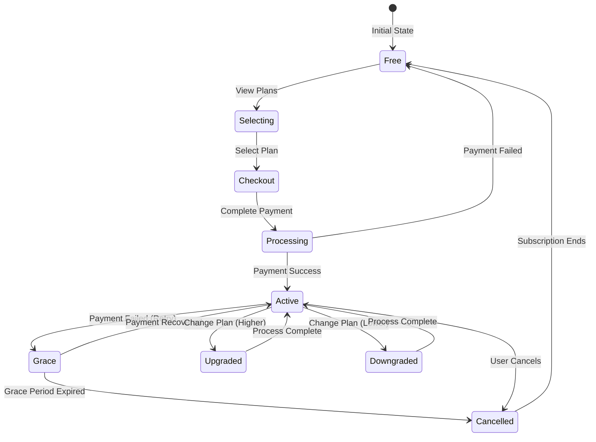
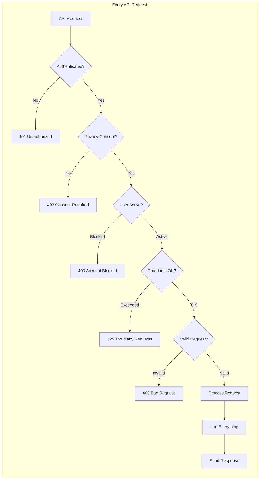
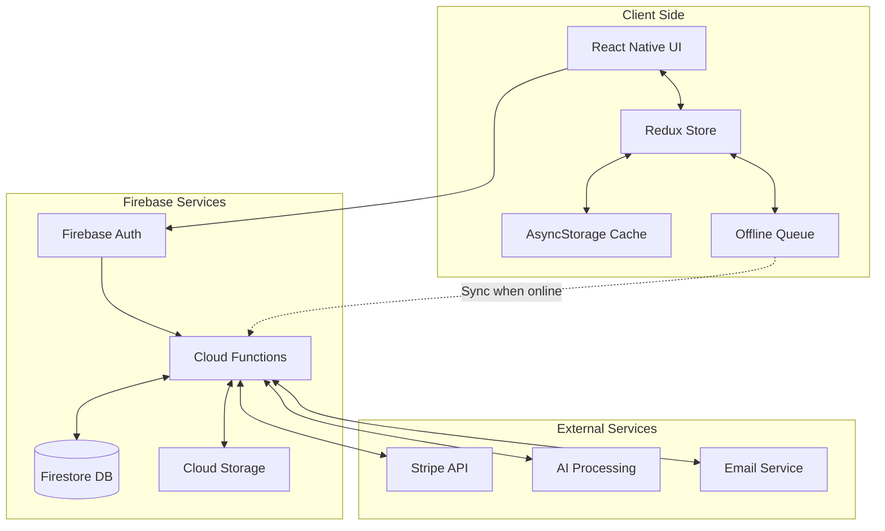
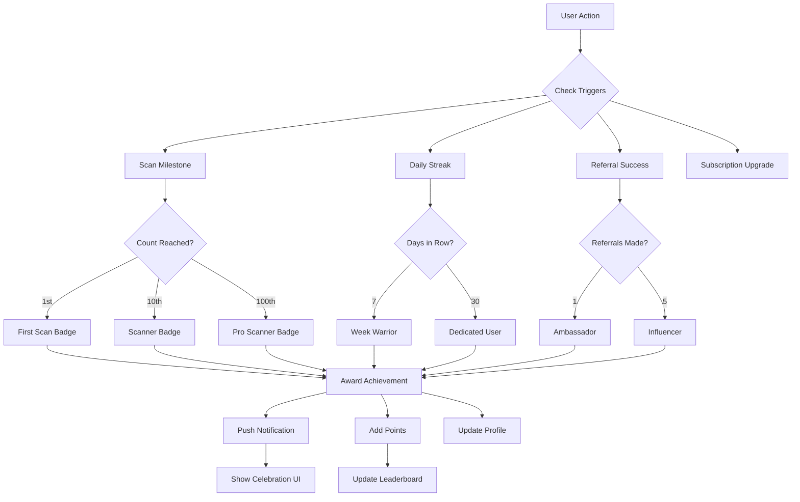
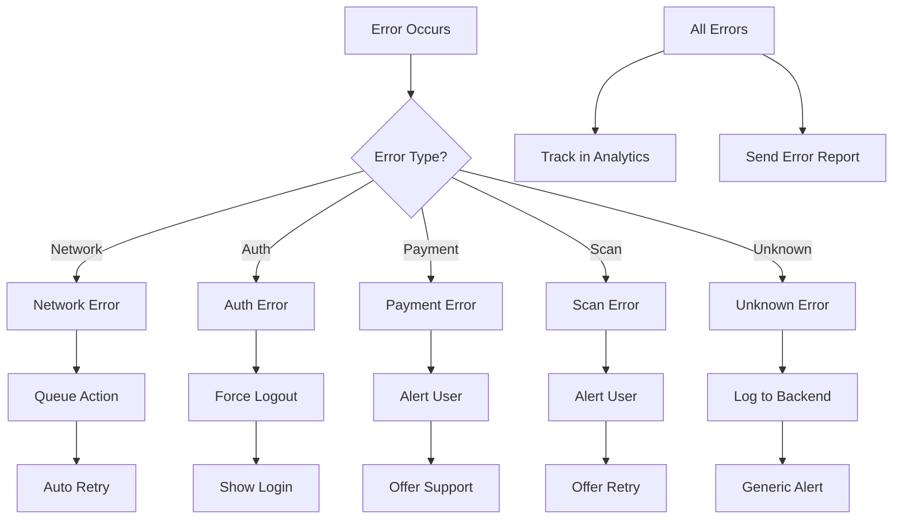
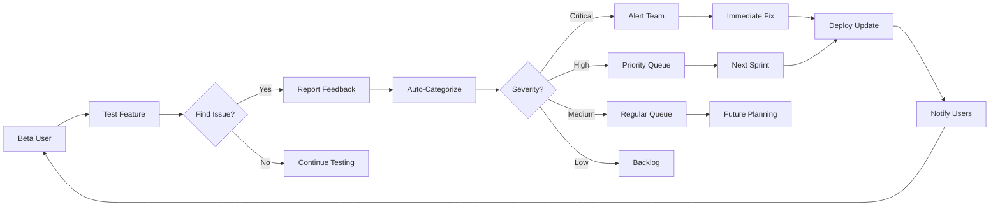

# Naturinex App Flow Visualization

## Complete User Journey Map

## Offline Queue Sync Flow

## Subscription Management Flow

## Security & Privacy Flow

## Data Flow Architecture

## Achievement & Gamification Flow

## Error Handling Flow

## Beta Testing Feedback Loop

## Complete Tech Stack Summary

| Component | Technology | Purpose |
|-----------|------------|---------|
| **Frontend** | React Native + Expo | Cross-platform mobile app |
| **Navigation** | Expo Router | File-based routing |
| **State Management** | Redux Toolkit | Global state management |
| **UI Components** | React Native Elements | Consistent UI |
| **Authentication** | Firebase Auth | User authentication |
| **Backend** | Firebase Functions | Serverless API |
| **Database** | Firestore | NoSQL database |
| **Storage** | Firebase Storage | Image storage |
| **Payments** | Stripe | Subscription management |
| **Analytics** | Firebase Analytics | User behavior tracking |
| **Crash Reporting** | Sentry | Error tracking |
| **Push Notifications** | Firebase FCM | User engagement |
| **CI/CD** | GitHub Actions + EAS | Automated deployment |
| **Monitoring** | Firebase Performance | Performance tracking |
| **A/B Testing** | Firebase Remote Config | Feature flags |

This architecture provides:
- ✅ Scalability
- ✅ Offline support
- ✅ Security
- ✅ Performance
- ✅ Cost efficiency
- ✅ Easy maintenance
- ✅ Rapid deployment