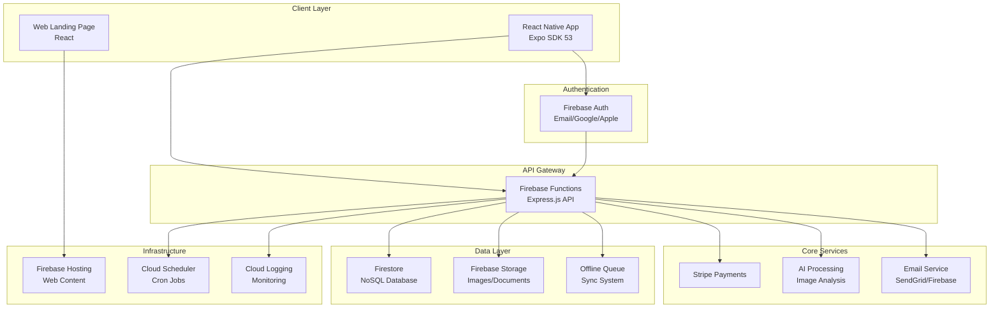
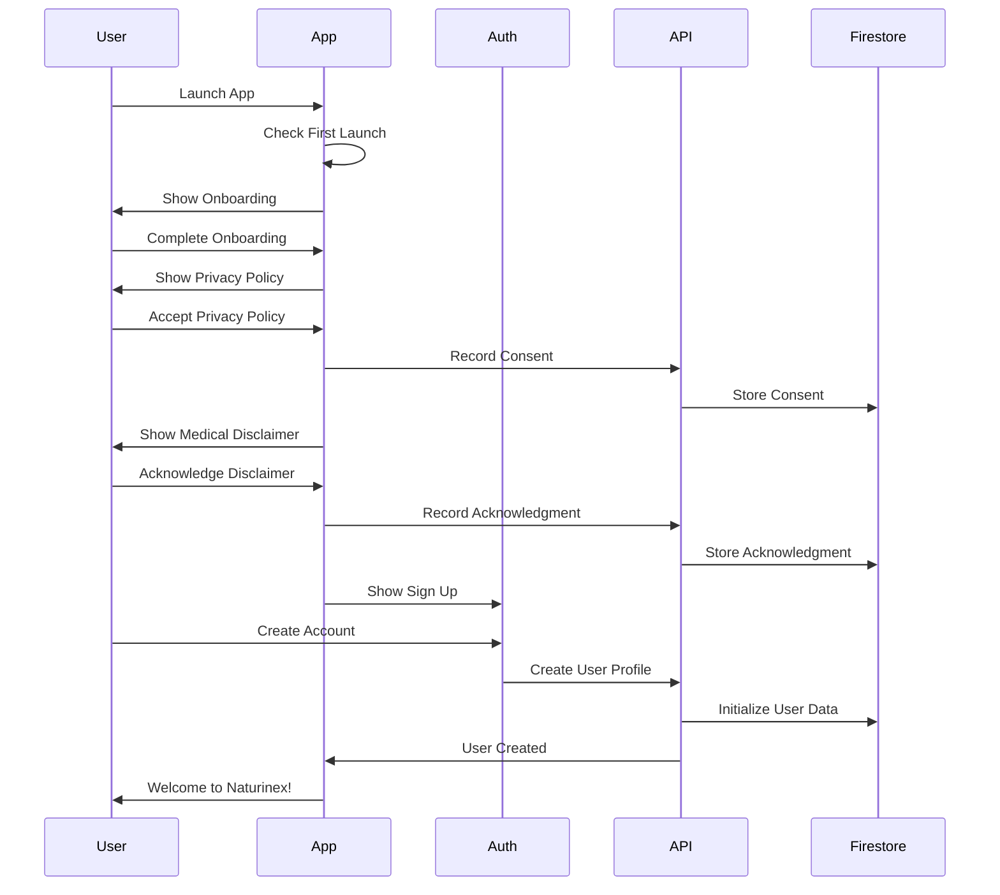
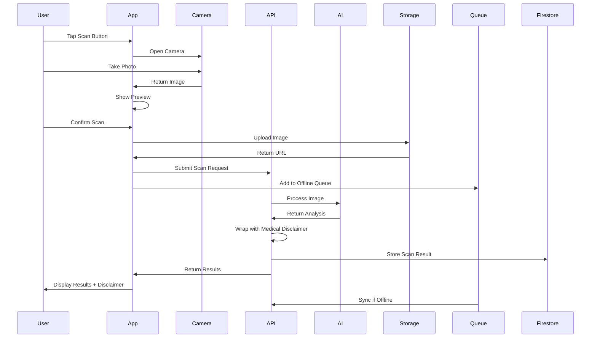
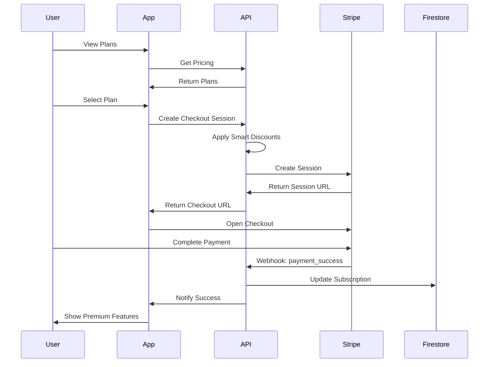

# Naturinex Architecture Documentation

## System Architecture Overview



## App Flow Diagrams

### 1. User Onboarding Flow



### 2. Product Scanning Flow



### 3. Subscription Flow



## Recommended Tech Stack

### ✅ Your Proposed Setup is Excellent! Here's the Complete Implementation:

## 1. Frontend Structure

```
naturinex-app/
├── app/                          # Expo Router app directory
│   ├── (auth)/                   # Authentication screens
│   │   ├── login.tsx
│   │   ├── register.tsx
│   │   └── forgot-password.tsx
│   ├── (tabs)/                   # Main app tabs
│   │   ├── _layout.tsx
│   │   ├── home.tsx
│   │   ├── scan.tsx
│   │   ├── history.tsx
│   │   └── profile.tsx
│   ├── (modal)/                  # Modal screens
│   │   ├── privacy-policy.tsx
│   │   ├── medical-disclaimer.tsx
│   │   └── subscription.tsx
│   ├── _layout.tsx               # Root layout
│   └── +not-found.tsx
├── components/                   # Reusable components
│   ├── auth/
│   ├── common/
│   ├── scan/
│   └── subscription/
├── services/                     # Business logic
│   ├── api.ts
│   ├── auth.ts
│   ├── offline-queue.ts
│   └── analytics.ts
├── store/                        # State management
│   ├── auth.store.ts
│   ├── user.store.ts
│   └── scan.store.ts
├── utils/                        # Utilities
│   ├── constants.ts
│   ├── helpers.ts
│   └── validation.ts
├── hooks/                        # Custom hooks
│   ├── useAuth.ts
│   ├── useSubscription.ts
│   └── useOffline.ts
└── assets/                       # Images, fonts, etc
```

## 2. Backend Structure

```
functions/
├── src/
│   ├── api/                      # API endpoints
│   │   ├── auth/
│   │   ├── scan/
│   │   ├── subscription/
│   │   └── user/
│   ├── services/                 # Business services
│   │   ├── stripe/
│   │   ├── ai/
│   │   ├── email/
│   │   └── analytics/
│   ├── middleware/               # Express middleware
│   │   ├── auth.ts
│   │   ├── security.ts
│   │   └── logging.ts
│   ├── utils/                    # Utilities
│   │   ├── database.ts
│   │   ├── validation.ts
│   │   └── errors.ts
│   ├── scheduled/                # Cron jobs
│   │   ├── cleanup.ts
│   │   ├── emails.ts
│   │   └── queue.ts
│   └── index.ts                  # Main entry
├── lib/                          # Compiled JS
└── package.json
```

## 3. Database Schema (Firestore)

```typescript
// Collections Structure
interface Collections {
  users: {
    // Document ID: userId
    email: string;
    displayName: string;
    photoURL?: string;
    subscription: {
      status: 'free' | 'active' | 'cancelled' | 'past_due';
      plan: 'basic' | 'premium' | 'professional';
      currentPeriodEnd?: Timestamp;
      stripeCustomerId?: string;
      stripeSubscriptionId?: string;
    };
    stats: {
      totalScans: number;
      monthlyScans: number;
      lastScan?: Timestamp;
      joinedAt: Timestamp;
    };
    preferences: {
      notifications: boolean;
      marketing: boolean;
      language: string;
      theme: 'light' | 'dark' | 'system';
    };
    privacyConsent: {
      accepted: boolean;
      version: string;
      timestamp: Timestamp;
    };
    medicalDisclaimer: {
      acknowledged: boolean;
      version: string;
      lastAcknowledged: Timestamp;
    };
  };
  
  scans: {
    // Document ID: scanId
    userId: string;
    timestamp: Timestamp;
    imageUrl: string;
    results: {
      productName: string;
      ingredients: string[];
      healthScore: number;
      warnings: string[];
      benefits: string[];
      alternatives: string[];
    };
    metadata: {
      deviceInfo: object;
      appVersion: string;
      processingTime: number;
    };
  };
  
  feedback: {
    // Document ID: feedbackId
    userId: string;
    type: string;
    message: string;
    severity: string;
    status: string;
    timestamp: Timestamp;
  };
  
  // System collections
  api_logs: {};
  error_logs: {};
  security_logs: {};
  offline_queue: {};
}
```

## 4. Firebase Security Rules

```javascript
// firestore.rules
rules_version = '2';
service cloud.firestore {
  match /databases/{database}/documents {
    // Helper functions
    function isAuthenticated() {
      return request.auth != null;
    }
    
    function isOwner(userId) {
      return request.auth.uid == userId;
    }
    
    function hasValidSubscription() {
      return get(/databases/$(database)/documents/users/$(request.auth.uid)).data.subscription.status == 'active';
    }
    
    // User rules
    match /users/{userId} {
      allow read: if isAuthenticated() && isOwner(userId);
      allow update: if isAuthenticated() && isOwner(userId) && 
        !request.resource.data.diff(resource.data).affectedKeys().hasAny(['subscription', 'stats']);
      allow create: if false; // Only through Cloud Functions
    }
    
    // Scan rules
    match /scans/{scanId} {
      allow read: if isAuthenticated() && resource.data.userId == request.auth.uid;
      allow create: if isAuthenticated() && 
        request.resource.data.userId == request.auth.uid &&
        hasValidSubscription();
      allow update, delete: if false; // Immutable
    }
    
    // Feedback rules
    match /feedback/{feedbackId} {
      allow read: if isAuthenticated() && resource.data.userId == request.auth.uid;
      allow create: if isAuthenticated() && 
        request.resource.data.userId == request.auth.uid;
      allow update, delete: if false;
    }
    
    // Admin collections - no client access
    match /{collection}/{document=**} {
      allow read, write: if false;
    }
  }
}
```

## 5. CI/CD Pipeline

### A. EAS Configuration (eas.json)

```json
{
  "cli": {
    "version": ">= 5.0.0"
  },
  "build": {
    "development": {
      "developmentClient": true,
      "distribution": "internal",
      "android": {
        "buildType": "apk"
      },
      "ios": {
        "simulator": true
      }
    },
    "preview": {
      "distribution": "internal",
      "android": {
        "buildType": "apk"
      },
      "env": {
        "EXPO_PUBLIC_ENV": "preview"
      }
    },
    "production": {
      "android": {
        "buildType": "app-bundle"
      },
      "ios": {
        "buildConfiguration": "Release"
      },
      "env": {
        "EXPO_PUBLIC_ENV": "production"
      }
    }
  },
  "submit": {
    "production": {
      "android": {
        "serviceAccountKeyPath": "./secrets/google-play-key.json",
        "track": "beta"
      },
      "ios": {
        "appleId": "your-apple-id@example.com",
        "ascAppId": "your-app-store-connect-app-id",
        "appleTeamId": "your-apple-team-id"
      }
    }
  }
}
```

### B. GitHub Actions Workflow

```yaml
# .github/workflows/deploy.yml
name: Deploy Naturinex

on:
  push:
    branches: [main]
  pull_request:
    branches: [main]

jobs:
  # Mobile App Build
  build-mobile:
    runs-on: ubuntu-latest
    steps:
      - uses: actions/checkout@v3
      
      - name: Setup Node
        uses: actions/setup-node@v3
        with:
          node-version: 18
          
      - name: Setup Expo
        uses: expo/expo-github-action@v8
        with:
          eas-version: latest
          token: ${{ secrets.EXPO_TOKEN }}
          
      - name: Install dependencies
        run: |
          cd naturinex-app
          npm install
          
      - name: Run tests
        run: |
          cd naturinex-app
          npm test
          
      - name: Build for preview
        if: github.event_name == 'pull_request'
        run: |
          cd naturinex-app
          eas build --platform all --profile preview --non-interactive
          
      - name: Build for production
        if: github.ref == 'refs/heads/main'
        run: |
          cd naturinex-app
          eas build --platform all --profile production --non-interactive

  # Backend Deployment
  deploy-backend:
    runs-on: ubuntu-latest
    needs: build-mobile
    if: github.ref == 'refs/heads/main'
    steps:
      - uses: actions/checkout@v3
      
      - name: Setup Node
        uses: actions/setup-node@v3
        with:
          node-version: 18
          
      - name: Install Firebase CLI
        run: npm install -g firebase-tools
        
      - name: Install dependencies
        run: |
          cd naturinex-app/functions
          npm install
          
      - name: Build functions
        run: |
          cd naturinex-app/functions
          npm run build
          
      - name: Deploy to Firebase
        env:
          FIREBASE_TOKEN: ${{ secrets.FIREBASE_TOKEN }}
        run: |
          cd naturinex-app
          firebase deploy --only functions,firestore:rules,storage:rules

  # Web Deployment
  deploy-web:
    runs-on: ubuntu-latest
    needs: build-mobile
    if: github.ref == 'refs/heads/main'
    steps:
      - uses: actions/checkout@v3
      
      - name: Setup Node
        uses: actions/setup-node@v3
        with:
          node-version: 18
          
      - name: Build landing page
        run: |
          cd web-landing
          npm install
          npm run build
          
      - name: Deploy to Firebase Hosting
        env:
          FIREBASE_TOKEN: ${{ secrets.FIREBASE_TOKEN }}
        run: |
          cd web-landing
          firebase deploy --only hosting
```

## 6. Environment Configuration

### A. Development (.env.development)
```env
EXPO_PUBLIC_API_URL=http://localhost:5001/naturinex/us-central1/api
EXPO_PUBLIC_STRIPE_PUBLISHABLE_KEY=pk_test_...
EXPO_PUBLIC_ENVIRONMENT=development
```

### B. Production (.env.production)
```env
EXPO_PUBLIC_API_URL=https://api.naturinex.com
EXPO_PUBLIC_STRIPE_PUBLISHABLE_KEY=pk_live_...
EXPO_PUBLIC_ENVIRONMENT=production
```

## 7. Monitoring & Analytics

### A. Firebase Analytics Events
```typescript
// Key events to track
const analyticsEvents = {
  // User journey
  'app_open': {},
  'sign_up_start': {},
  'sign_up_complete': { method: string },
  'login': { method: string },
  
  // Core features
  'scan_initiated': {},
  'scan_completed': { product_type: string },
  'scan_failed': { error: string },
  
  // Monetization
  'view_plans': {},
  'select_plan': { plan: string },
  'purchase_complete': { plan: string, revenue: number },
  'purchase_failed': { error: string },
  
  // Engagement
  'share_result': { method: string },
  'view_history': {},
  'submit_feedback': { type: string },
};
```

### B. Performance Monitoring
```typescript
// Monitor key operations
import perf from '@react-native-firebase/perf';

// Track scan performance
const scanTrace = await perf().startTrace('product_scan');
scanTrace.putAttribute('product_type', 'food');
// ... perform scan
scanTrace.stop();

// Track API calls
const apiTrace = await perf().startTrace('api_call');
apiTrace.putAttribute('endpoint', '/scan');
// ... make API call
apiTrace.stop();
```

## 8. Storage Strategy

### Current: Firebase Storage
```typescript
// Good for MVP and small-medium scale
const uploadImage = async (uri: string) => {
  const blob = await fetch(uri).then(r => r.blob());
  const ref = storage().ref(`scans/${userId}/${Date.now()}.jpg`);
  await ref.put(blob);
  return await ref.getDownloadURL();
};
```

### Future: AWS S3 Migration
```typescript
// When you need more control and cost optimization
const uploadToS3 = async (uri: string) => {
  // Get presigned URL from your API
  const { uploadUrl } = await api.getS3UploadUrl();
  
  // Direct upload to S3
  const blob = await fetch(uri).then(r => r.blob());
  await fetch(uploadUrl, {
    method: 'PUT',
    body: blob,
    headers: { 'Content-Type': 'image/jpeg' }
  });
};
```

## 9. Optimization Strategies

### A. App Performance
1. **Image Optimization**: Compress before upload
2. **Lazy Loading**: Load features on demand
3. **Caching**: Implement Redux Persist
4. **Code Splitting**: Use dynamic imports

### B. Backend Performance
1. **Function Cold Starts**: Keep functions warm
2. **Database Indexes**: Optimize Firestore queries
3. **CDN**: Use Firebase Hosting CDN
4. **Response Caching**: Cache common responses

### C. Cost Optimization
1. **Firestore**: Batch writes, compound queries
2. **Functions**: Optimize memory allocation
3. **Storage**: Implement lifecycle rules
4. **Monitoring**: Set up billing alerts

## Launch Checklist

- [ ] App Store assets ready (screenshots, description)
- [ ] Privacy Policy and Terms updated
- [ ] SSL certificates configured
- [ ] Domain names set up
- [ ] Email templates created
- [ ] Support system ready
- [ ] Analytics tracking verified
- [ ] Performance benchmarks set
- [ ] Security audit completed
- [ ] Beta testing completed
- [ ] Marketing materials prepared
- [ ] Launch announcement scheduled